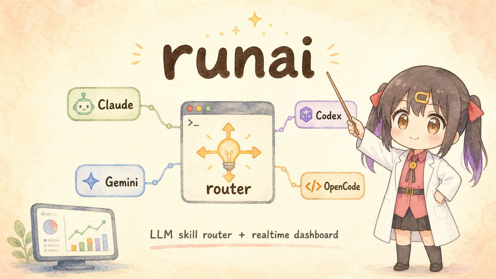

<div align="center">



# runai

### One terminal-native router for your AI CLI skills

<p>跨 Claude Code / Codex / Gemini CLI / OpenCode 的统一 skill / MCP 管理 + LLM 智能路由器 + 实时遥测仪表盘。</p>

<p>
  <a href="README.md"><b>English</b></a>
  &nbsp;|&nbsp;
  <a href="README_zh.md"><b>中文</b></a>
</p>

<p>
  <a href="#quickstart"><b>Quickstart</b></a>
  &nbsp;·&nbsp;
  <a href="#three-pillars"><b>Three Pillars</b></a>
  &nbsp;·&nbsp;
  <a href="#architecture"><b>Architecture</b></a>
  &nbsp;·&nbsp;
  <a href="AGENTS.md"><b>AGENT guide</b></a>
</p>

<sub>Single Rust binary · macOS / Linux / Windows · No runtime deps · MIT</sub>

</div>

---

<div align="center">

## Architecture


</div>

---

## One-liner

`runai` unifies how you install, enable, recommend, and observe AI CLI skills across four host CLIs. Skills are real folders on disk symlinked into each CLI's skills directory; MCP servers are real entries in each CLI's config file. Filesystem = source of truth, DB only holds metadata.

On top of that core, an opt-in LLM skill **router** auto-picks the right skill for every user prompt (BM25 prefilter + LLM rerank with verified-adoption counting), and a local **dashboard** at `http://127.0.0.1:17888` shows every hook invocation, token cost, latency, and chosen skill in real time.

---

## Pain points it solves

| Before | runai |
|---|---|
| Skills scattered across Claude Code / Codex / Gemini / OpenCode, each with its own config quirks | One TUI + CLI + MCP server manages all four; native config format per target |
| `git clone` a skill repo, copy folders, edit JSON / TOML by hand, repeat for every CLI | `runai install owner/repo` — downloads, registers, groups, symlinks into every CLI in one shot |
| 2000+ skills out there, no way to browse without leaving the terminal | Built-in market: `runai market` browses cached index, Enter to install |
| Hard-deleted skills can't be recovered when you change your mind | Trash-first: `runai uninstall` moves to `~/.runai/trash/`, `runai trash restore` brings it back |
| "Did I enable that skill?" — `ls` four directories, compare with config files, hope they agree | Source of truth = symlink existence + config entry presence; `runai status` reads filesystem live |
| No idea which skills you actually use, no idea what the router is doing per turn | Dashboard at 127.0.0.1:17888 — every router call logged with chosen skill, BM25 hits, full LLM input, hook output, latency, tokens |

---

## Three pillars

### 1. Multi-CLI skill / MCP manager

- **Install once, enabled everywhere** — `runai install owner/repo[@branch]` downloads the skill, registers it in DB, and symlinks into all four CLI skill dirs. MCP entries get written into each CLI's native config (Claude JSON / Codex TOML / Gemini JSON / OpenCode JSON).
- **Filesystem = truth** — Skill enabled ⇔ symlink exists at `<cli-home>/skills/<name>`. MCP enabled ⇔ entry present (without `"disabled": true`) in target config. The DB is metadata-only; nothing breaks if you blow it away.
- **Groups** — Cluster related skills (`figma`, `ktv-car-project`, `ppt-slides`, …) into named groups; enable / disable / rename whole groups atomically.
- **Market** — Built-in skill marketplace with 2,000+ skills curated; cached locally, refreshed in the background (1h TTL). `runai market install <name>` is one-shot.
- **Safe delete** — Everything trash-first. Restore until you `runai trash purge`.

### 2. LLM skill router (opt-in)

- **Hook integration** — Claude Code's `UserPromptSubmit` hook → `runai recommend` → router decides → output injected into the agent's prompt as additional context.
- **BM25 prefilter + LLM rerank** — Bilingual (latin + CJK) BM25 on AI-generated summaries; top 30 candidates handed to the router LLM (DeepSeek v4-flash by default; any OpenAI-compatible / Anthropic / `claude-cli` backend works). Hybrid score = `BM25 × 0.4 + LLM_quality × 0.6`.
- **AI summary enrichment** — Every skill gets a bilingual, structured summary (`task / triggers / inputs / outputs / not-for / score`) generated by the same LLM; reused as the BM25 indexing doc and the router's candidate context. Auto-refreshes on SKILL.md edit, and `runai install` / `scan` fire targeted re-enrich for just the changed skills.
- **Two modes** — `EXCLUSIVE` lets the main agent pick from candidates; `COMPATIBLE` loads several complementary skills at once for workflow-style prompts ("整套调试链路" / "完整发版流程"). Same-session dedup so already-adopted skills don't get re-recommended.
- **Verified adoption** — When the main agent actually `Read`s a `<skills_dir>/<X>/SKILL.md`, a `PostToolUse` hook bumps `usage_count` and writes a session adoption row. Self-report (`runai recommend used`) is fallback. The signal is Claude Code's own tool-call log, not the agent's word.
- **`runai recommend get <skill>`** — Atomic skill activation: stdout = SKILL.md body, side effect = usage_count +1 + session adoption. Hook output gives this command instead of a raw path, so calling it = adopting it.

### 3. Realtime telemetry dashboard

- **Single binary, no CDN** — `runai server` boots an embedded axum HTTP server; `web/{index.html,app.css,app.js}` are `include_str!`'d into the Rust binary.
- **Auto-launch on every Claude Code session** — `runai server --install-hook` adds a `SessionStart` hook so the dashboard is always at `http://127.0.0.1:17888` when you open Claude Code.
- **Every router call instrumented** — Per-event: model + provider, mode (compat / excl), candidate count, BM25 kept, prompt / completion / total tokens, latency, chosen skills, status, error, full user prompt, working dir, full LLM input string (64 KB cap), full hook output the agent received.
- **Per-skill drill-down** — `/skills` lists every managed skill with usage count, LLM quality score, AI summary; click into one to see its full directory tree (browse SKILL.md + supporting files), recent usage events, raw description vs. enriched summary.
- **Live polling** — 5s refresh with `inFlight` guard and `visibilitychange` pause. Per-boot cache-buster on static assets means a server restart after `cargo install` propagates without a hard refresh.

---

## Quickstart

### Install

```bash
cargo install --git https://github.com/Crosery/runai
# or download a prebuilt binary
curl -fsSL https://github.com/Crosery/runai/releases/latest/download/runai-darwin-arm64.tar.gz \
  | tar xz && mv runai ~/.cargo/bin/
```

Prebuilt artifacts for `{linux,darwin,windows} × {amd64,arm64}` on the [releases page](https://github.com/Crosery/runai/releases).
Windows needs Developer Mode or Administrator for symlinks.

### First-run setup

```bash
# 1) Boot the TUI to browse / enable existing skills you already have plus 2000+ market entries
runai

# 2) Opt-in to the LLM router (default DeepSeek v4-flash, ~$0.0001 per route call)
runai recommend setup
runai recommend install-hook          # writes UserPromptSubmit + PostToolUse + SessionStart hooks
                                       # into ~/.claude/settings.json (idempotent, .runai-bak backup)

# 3) Launch the dashboard once; the hook keeps it running thereafter
runai server --port 17888 --ensure
runai server --install-hook            # auto-launch on every Claude Code session
```

After step 2, every Claude Code prompt routes through `runai recommend`, every SKILL.md `Read` records adoption, and every event lands in the dashboard.

### Daily commands

```bash
runai                                 # TUI
runai install owner/repo              # install skill from GitHub into all CLIs
runai market install <name>           # install from market
runai search <query>                  # search installed + market
runai status                          # show enabled / disabled across all CLIs
runai list --target claude            # one-CLI view
runai backup                          # timestamped backup of skills + configs
runai trash                           # browse deleted, restore or purge
runai recommend enrich                # regenerate AI summaries (changed-mtime detection)
runai recommend stats                 # router LLM usage / cost / latency over time
runai doctor                          # health check; `--fix` prunes dangling symlinks
```

Full CLI list: `runai --help`.

---

## What lives where

```
~/.runai/                              ~/.{claude,codex,gemini,opencode}/skills/
├── skills/<name>/SKILL.md            └── <name> -> ~/.runai/skills/<name>     ← symlink = enabled
├── mcps/<name>.json                  ~/.claude.json          ← MCP entries (Claude)
├── groups/<id>.toml                  ~/.codex/config.toml    ← MCP entries (Codex)
├── trash/<trash-id>/                 ~/.gemini/settings.json ← MCP entries (Gemini)
├── backups/<timestamp>/              ~/.config/opencode/opencode.json ← MCP entries (OpenCode)
├── market-cache/
├── config.toml                        ← runai recommend config (provider, model, api_key)
└── runai.db                           ← SQLite: skill metadata, usage, router_events, AI summaries
```

Auto-migrated from `~/.skill-manager/` on first launch (v0.5.0 transition). Env overrides honored: `RUNE_DATA_DIR` and `SKILL_MANAGER_DATA_DIR`.

---

## Project layout

| Module | Source | What it does |
|---|---|---|
| `cli/` | `src/cli/mod.rs` | clap subcommand dispatch; entry point for every `runai <verb>` |
| `core::manager` | `src/core/manager.rs` | `SkillManager` orchestrates install / enable / disable / trash / migrate |
| `core::scanner` | `src/core/scanner.rs` | Filesystem discovery + adoption of unmanaged skills (with cross-data-dir safety guard) |
| `core::linker` | `src/core/linker.rs` | Cross-platform symlink create / remove / detect |
| `core::recommend` | `src/core/recommend.rs` | LLM skill router (BM25 + AI summary + LLM rerank + adoption tracking) |
| `core::db` | `src/core/db.rs` | SQLite schema (v14) + migrations + queries |
| `core::installer` | `src/core/installer.rs` | GitHub / market install pipeline |
| `mcp::tools` | `src/mcp/tools.rs` | 22 `sm_*` tools exposed via MCP stdio |
| `tui/` | `src/tui/` | ratatui + crossterm full-screen UI |
| `server` | `src/server.rs` | axum dashboard for router telemetry |

Per-module deep-dive docs in `src/**/*.LLM.md`. Architecture invariants in [AGENTS.md](AGENTS.md).

---

## Design principles

- **Filesystem is the source of truth.** Skill enabled = symlink exists. MCP enabled = config entry present. DB carries metadata only; rebuild it from disk any time.
- **Trash-first everywhere.** Delete is reversible until `runai trash purge`. Backups timestamped, restorable.
- **Single binary, no runtime deps.** Web dashboard assets `include_str!`'d in. rusqlite bundled. No node, no python, no Docker.
- **Router is opt-in.** Default `enabled = false`; nothing reaches a network until `runai recommend setup`.
- **Verified adoption over self-report.** Counting comes from Claude Code's own tool-call log (PostToolUse hook on `Read`), not the agent's promise.
- **Safety guards on destructive syscalls.** `scan` / `adopt` refuse to `rename` across data dirs after the 2026-04-27 incident. Physical-e2e tests in `tests/safety_e2e.rs` lock the invariant.
- **Documentation invariant.** Every code change ships its `*.LLM.md` update in the same commit (see [AGENTS.md](AGENTS.md)).

---

## License

MIT
