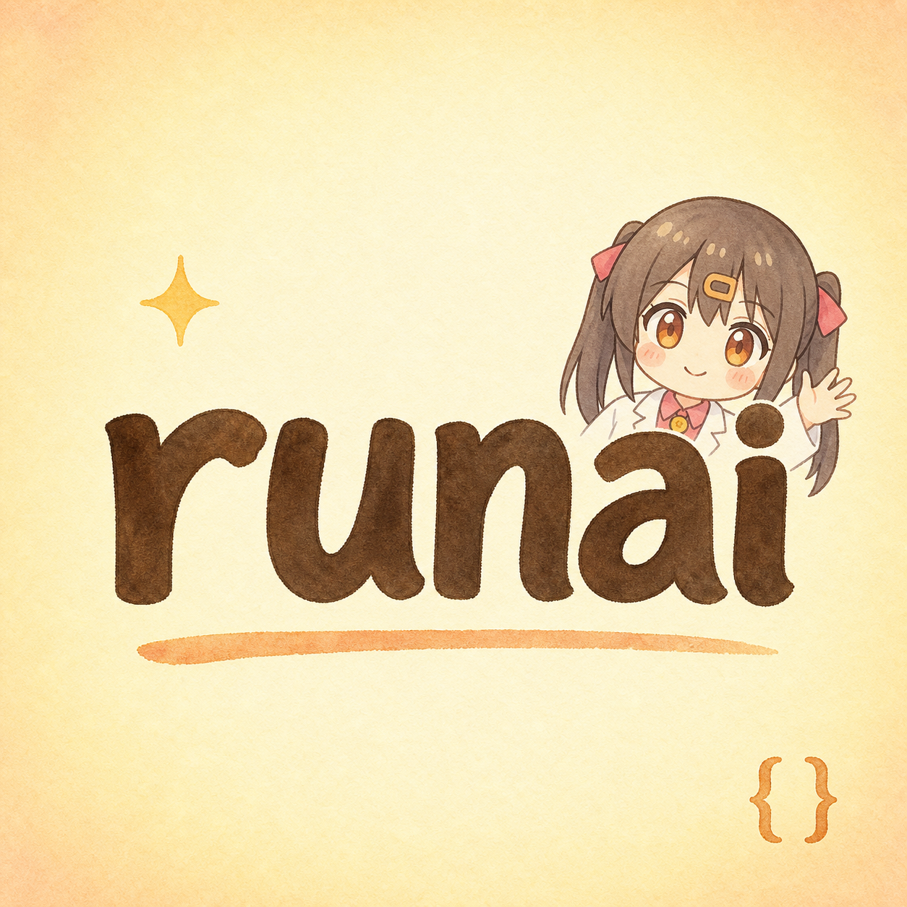
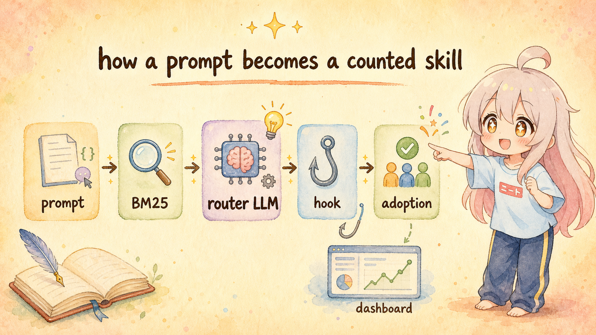

<div align="center">



# runai

### 一个终端原生的 AI CLI skill 路由器

<p>跨 Claude Code / Codex / Gemini CLI / OpenCode 的统一 skill / MCP 管理 + LLM 智能路由器 + 实时遥测仪表盘。</p>

<p>
  <a href="README.md"><b>English</b></a>
  &nbsp;|&nbsp;
  <a href="README_zh.md"><b>中文</b></a>
</p>

<p>
  <a href="#快速开始"><b>快速开始</b></a>
  &nbsp;·&nbsp;
  <a href="#三大支柱"><b>三大支柱</b></a>
  &nbsp;·&nbsp;
  <a href="#架构一览"><b>架构一览</b></a>
  &nbsp;·&nbsp;
  <a href="AGENTS.md"><b>AGENT 指南</b></a>
</p>

<sub>单一 Rust 二进制 · macOS / Linux / Windows · 无运行时依赖 · MIT</sub>

</div>

---

<div align="center">

## 架构一览



</div>

---

## 一句话

`runai` 把"如何在四个 AI CLI 上安装、启用、推荐、观测 skill"这件事统一了。Skill 是磁盘上真实的目录，通过 symlink 关联到每个 CLI 的 skills 目录；MCP server 是每个 CLI 配置文件里的真实条目。**文件系统 = 真值，DB 只存元数据**。

在这套核心之上：

- **LLM skill router** 选 (opt-in)：每条 user prompt 自动选最合适的 skill 注入主 agent 上下文（BM25 prefilter + LLM rerank + 真采用计数）
- **本地 dashboard** 在 `http://127.0.0.1:17888`：每次 hook 触发、token 成本、延迟、被选 skill、完整 LLM 输入 都实时记录

---

## 解决的痛点

| 你以前的痛点 | runai 怎么解 |
|---|---|
| Skill 散落在 Claude Code / Codex / Gemini / OpenCode，每个 CLI 配置都有自己的坑 | 一个 TUI + CLI + MCP server 管全四个；每个 target 写原生格式 |
| `git clone` skill repo、手动拷文件夹、改 JSON / TOML、四个 CLI 重复一遍 | `runai install owner/repo` —— 一键下载 + 入库 + 分组 + symlink 到所有 CLI |
| 2000+ skill 散在 GitHub，没办法在终端里浏览 | 内置 market：`runai market` 浏览本地缓存索引，Enter 直接装 |
| 删了的 skill 想恢复回不来 | Trash-first：`runai uninstall` 进 `~/.runai/trash/`，`runai trash restore` 拉回来 |
| "我到底启用了哪些 skill？" —— `ls` 四个目录、对比配置文件、祈祷它们一致 | 真值 = symlink 存在 + 配置条目存在；`runai status` 实时读文件系统 |
| 不知道自己实际用了哪些 skill，不知道 router 每轮在干嘛 | Dashboard 在 127.0.0.1:17888 —— 每次 router 调用都记下被选 skill / BM25 命中 / 完整 LLM 输入 / hook 输出 / 延迟 / token |

---

## 三大支柱

### 1. 多 CLI skill / MCP 管理器

- **一次安装，全 CLI 启用** —— `runai install owner/repo[@branch]` 下载 skill、入 DB、symlink 进四个 CLI 的 skills 目录。MCP 条目按每个 CLI 的原生格式写（Claude JSON / Codex TOML / Gemini JSON / OpenCode JSON）。
- **文件系统 = 真值** —— Skill 启用 ⇔ `<cli-home>/skills/<name>` 存在 symlink。MCP 启用 ⇔ 目标 config 里有条目（无 `"disabled": true`）。DB 只是元数据；删了 DB 也不会坏事。
- **分组** —— 把相关 skill（`figma` / `ktv-car-project` / `ppt-slides` …）聚成命名组；按组批量启用 / 禁用 / 重命名。
- **Market** —— 内置 2000+ skill 市场，本地缓存，后台 1h TTL 刷新。`runai market install <name>` 一键装。
- **安全删除** —— 全部 trash-first，`runai trash purge` 才真删。

### 2. LLM skill router（opt-in）

- **Hook 集成** —— Claude Code 的 `UserPromptSubmit` hook → `runai recommend` → router 决策 → 输出作为额外 context 注入主 agent 的 prompt。
- **BM25 prefilter + LLM rerank** —— 双语（latin + CJK）BM25 在 AI 生成的 summary 上跑，top 30 candidate 喂给 router LLM（默认 DeepSeek v4-flash；也支持任意 OpenAI 兼容 / Anthropic / `claude-cli` 后端）。混合分 = `BM25 × 0.4 + LLM 质量 × 0.6`。
- **AI summary 富集** —— 每个 skill 都由同一个 LLM 生成结构化双语 summary（`task / triggers / inputs / outputs / not-for / score`），既当 BM25 索引文本也当 router 候选上下文。SKILL.md 编辑后自动 refresh，`runai install` / `scan` 也会针对改动的 skill 单点 re-enrich。
- **两种模式** —— `EXCLUSIVE` 让主 agent 在候选里挑；`COMPATIBLE` 一次加载多个互补 skill 适合工作流型 prompt（"整套调试链路" / "完整发版流程"）。同 session 去重，已采用的 skill 不再被重推。
- **真采用计数** —— 主 agent 真的 `Read` 了 `<skills_dir>/<X>/SKILL.md` 时，`PostToolUse` hook 自动 bump `usage_count` 并写 session adoption 行。Self-report (`runai recommend used`) 是兜底。**信号来源是 Claude Code 自己的工具调用日志，不是 agent 自己说**。
- **`runai recommend get <skill>`** —— 原子激活：stdout = SKILL.md 全文，副作用 = usage_count +1 + session adoption。hook 输出给这条命令而不是原始路径，调用即采用。

### 3. 实时遥测仪表盘

- **单一 binary 无 CDN** —— `runai server` 启动嵌入的 axum HTTP server；`web/{index.html,app.css,app.js}` 通过 `include_str!` 编译进 Rust 二进制。
- **每个 Claude Code 会话自动拉起** —— `runai server --install-hook` 加 `SessionStart` hook，让 dashboard 永远在 `http://127.0.0.1:17888`。
- **每次 router 调用都有埋点** —— 每条事件：model + provider，mode (compat / excl)，候选数，BM25 kept，prompt / completion / total tokens，延迟，被选 skill，状态，错误，完整 user prompt，工作目录，完整 LLM 输入字符串（64 KB cap），完整 hook 输出。
- **Skill 详情下钻** —— `/skills` 列出每个 skill 的使用次数、LLM 质量分、AI summary；点进去看完整目录树（浏览 SKILL.md + 配套文件）、最近使用历史、原始 description vs 富集后的 summary。
- **实时刷新** —— 5 秒轮询 + `inFlight` 防并发 + `visibilitychange` 切后台自动暂停。静态资源每次 boot 加 `?v=<时间戳>` cache buster，`cargo install` 升级 binary 后浏览器普通 reload 就拿新版，不用 hard refresh。

---

## 快速开始

### 安装

```bash
cargo install --git https://github.com/Crosery/runai
# 或者下载预编译二进制
curl -fsSL https://github.com/Crosery/runai/releases/latest/download/runai-darwin-arm64.tar.gz \
  | tar xz && mv runai ~/.cargo/bin/
```

预编译的 `{linux,darwin,windows} × {amd64,arm64}` 在 [releases 页](https://github.com/Crosery/runai/releases)。
Windows 上 symlink 需要开发者模式或管理员权限。

### 首次配置

```bash
# 1) 启动 TUI 浏览 / 启用已有 skill + 2000+ market skill
runai

# 2) 开启 LLM router (默认 DeepSeek v4-flash，约 $0.0001 / 次)
runai recommend setup
runai recommend install-hook          # 把 UserPromptSubmit + PostToolUse + SessionStart hook
                                       # 写进 ~/.claude/settings.json（幂等，留 .runai-bak 备份）

# 3) 启动一次 dashboard，之后 hook 会自动拉起
runai server --port 17888 --ensure
runai server --install-hook            # 每个 Claude Code session 自动拉起
```

第 2 步装完，每条 Claude Code prompt 都走 `runai recommend`，每次 SKILL.md `Read` 都记账，每条事件都进 dashboard。

### 日常命令

```bash
runai                                 # TUI
runai install owner/repo              # 从 GitHub 安装 skill 到所有 CLI
runai market install <name>           # 从 market 安装
runai search <query>                  # 搜已安装 + market
runai status                          # 看所有 CLI 的启用 / 禁用状态
runai list --target claude            # 单 CLI 视图
runai backup                          # 带时间戳备份 skill + 配置
runai trash                           # 浏览已删，restore 或 purge
runai recommend enrich                # 重生 AI summary（mtime 检测增量）
runai recommend stats                 # router LLM 用量 / 成本 / 延迟统计
runai doctor                          # 健康检查；`--fix` 清理 dangling symlink
```

完整 CLI 列表：`runai --help`。

---

## 数据放在哪

```
~/.runai/                              ~/.{claude,codex,gemini,opencode}/skills/
├── skills/<name>/SKILL.md            └── <name> -> ~/.runai/skills/<name>     ← symlink = 启用
├── mcps/<name>.json                  ~/.claude.json          ← MCP 条目 (Claude)
├── groups/<id>.toml                  ~/.codex/config.toml    ← MCP 条目 (Codex)
├── trash/<trash-id>/                 ~/.gemini/settings.json ← MCP 条目 (Gemini)
├── backups/<timestamp>/              ~/.config/opencode/opencode.json ← MCP 条目 (OpenCode)
├── market-cache/
├── config.toml                        ← runai recommend 配置 (provider, model, api_key)
└── runai.db                           ← SQLite: skill 元数据 / 使用统计 / router_events / AI summary
```

首次启动自动从 `~/.skill-manager/` 迁移过来（v0.5.0 转换）。Env 覆盖支持：`RUNE_DATA_DIR` 和 `SKILL_MANAGER_DATA_DIR`。

---

## 项目结构

| 模块 | 源码 | 干什么 |
|---|---|---|
| `cli/` | `src/cli/mod.rs` | clap 子命令分发；每个 `runai <verb>` 的入口 |
| `core::manager` | `src/core/manager.rs` | `SkillManager` 协调 install / enable / disable / trash / migrate |
| `core::scanner` | `src/core/scanner.rs` | 文件系统发现 + 未管理 skill 的 adopt（含 cross-data-dir 安全 guard）|
| `core::linker` | `src/core/linker.rs` | 跨平台 symlink create / remove / detect |
| `core::recommend` | `src/core/recommend.rs` | LLM skill router (BM25 + AI summary + LLM rerank + adoption tracking) |
| `core::db` | `src/core/db.rs` | SQLite schema (v14) + migration + 查询层 |
| `core::installer` | `src/core/installer.rs` | GitHub / market 安装流水线 |
| `mcp::tools` | `src/mcp/tools.rs` | 22 个 `sm_*` 工具通过 MCP stdio 暴露 |
| `tui/` | `src/tui/` | ratatui + crossterm 全屏 UI |
| `server` | `src/server.rs` | axum dashboard 服务 router 遥测 |

每个模块的深度文档在 `src/**/*.LLM.md`。架构不变量在 [AGENTS.md](AGENTS.md)。

---

## 设计原则

- **文件系统是真值** —— Skill 启用 = symlink 存在。MCP 启用 = config 条目存在。DB 只是元数据；删掉 DB 也能从磁盘重建。
- **Trash-first 全员通用** —— 删除可恢复，直到 `runai trash purge`。备份带时间戳，可还原。
- **单 binary，无运行时依赖** —— Web dashboard 资产 `include_str!` 进 binary。rusqlite bundled。无 node、无 python、无 Docker。
- **Router opt-in** —— 默认 `enabled = false`；`runai recommend setup` 之前没有任何网络请求。
- **真采用 > self-report** —— 计数靠 Claude Code 自己的工具调用日志（PostToolUse hook on `Read`），不是 agent 自己说。
- **破坏性 syscall 加 guard** —— `scan` / `adopt` 在 2026-04-27 事故后拒绝跨 data dir 做 `rename`。`tests/safety_e2e.rs` 物理 e2e 测试锁不变量。
- **文档同步铁律** —— 每个代码改动同 commit 改 `*.LLM.md`（见 [AGENTS.md](AGENTS.md)）。

---

## 许可证

MIT
